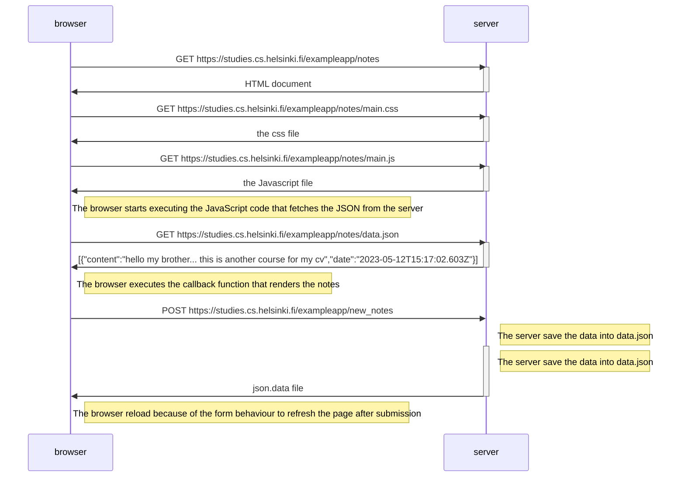
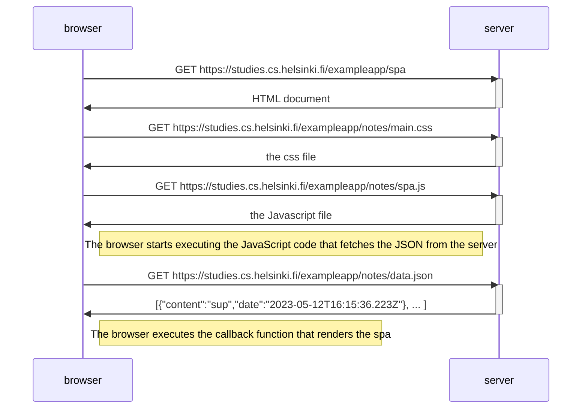
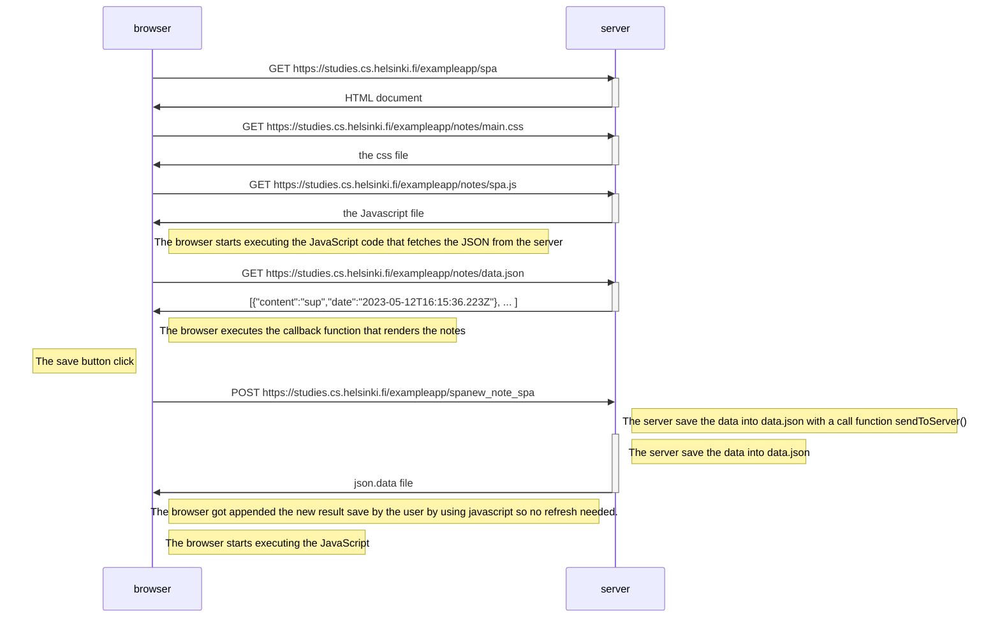

<h2>EXERCISE 0.4</h2>

```mermaid
sequenceDiagram
    participant browser
    participant server

    browser ->> server: GET https://studies.cs.helsinki.fi/exampleapp/notes
    activate server
    server ->> browser: HTML document
    deactivate server
    
    browser ->> server: GET https://studies.cs.helsinki.fi/exampleapp/notes/main.css
    activate server
    server ->> browser: the css file
    deactivate server

    browser ->> server: GET https://studies.cs.helsinki.fi/exampleapp/notes/main.js
    activate server
    server ->> browser: the Javascript file
    deactivate server

    Note right of browser: The browser starts executing the JavaScript code that fetches the JSON from the server

    browser ->> server: GET https://studies.cs.helsinki.fi/exampleapp/notes/data.json
    activate server
    server ->> browser: [{"content":"hello my brother... this is another course for my cv","date":"2023-05-12T15:17:02.603Z"}]
    deactivate server
    
    Note right of browser: The browser executes the callback function that renders the notes

    browser ->> server: POST https://studies.cs.helsinki.fi/exampleapp/new_notes
    Note right of server: The server save the data into data.json
    activate server
    Note right of server: The server save the data into data.json
    server ->> browser: json.data file
    deactivate server

    Note right of browser: The browser reload because of the form behaviour to refresh the page after submission
```

<h2>EXERCISE 0.5</h2>

```mermaid

sequenceDiagram
    participant browser
    participant server

    browser ->> server: GET https://studies.cs.helsinki.fi/exampleapp/spa
    activate server
    server ->> browser: HTML document
    deactivate server
    
    browser ->> server: GET https://studies.cs.helsinki.fi/exampleapp/notes/main.css
    activate server
    server ->> browser: the css file
    deactivate server

    browser ->> server: GET https://studies.cs.helsinki.fi/exampleapp/notes/spa.js
    activate server
    server ->> browser: the Javascript file
    deactivate server

    Note right of browser: The browser starts executing the JavaScript code that fetches the JSON from the server

    browser ->> server: GET https://studies.cs.helsinki.fi/exampleapp/notes/data.json
    activate server
    server ->> browser: [{"content":"sup","date":"2023-05-12T16:15:36.223Z"}, ... ]
    deactivate server

    Note right of browser: The browser executes the callback function that renders the spa
```

<h2>EXERCISE 0.6</h2>

```mermaid

sequenceDiagram
    participant browser
    participant server

    browser ->> server: GET https://studies.cs.helsinki.fi/exampleapp/spa
    activate server
    server ->> browser: HTML document
    deactivate server
    
    browser ->> server: GET https://studies.cs.helsinki.fi/exampleapp/notes/main.css
    activate server
    server ->> browser: the css file
    deactivate server

    browser ->> server: GET https://studies.cs.helsinki.fi/exampleapp/notes/spa.js
    activate server
    server ->> browser: the Javascript file
    deactivate server

    Note right of browser: The browser starts executing the JavaScript code that fetches the JSON from the server

    browser ->> server: GET https://studies.cs.helsinki.fi/exampleapp/notes/data.json
    activate server
    server ->> browser: [{"content":"sup","date":"2023-05-12T16:15:36.223Z"}, ... ]
    deactivate server

    Note right of browser: The browser executes the callback function that renders the notes
    Note left of browser: The save button click

    browser ->> server: POST https://studies.cs.helsinki.fi/exampleapp/spanew_note_spa
    Note right of server: The server save the data into data.json with a call function sendToServer()
    activate server
    Note right of server: The server save the data into data.json
    server ->> browser: json.data file
    deactivate server

    Note right of browser: The browser got appended the new result save by the user by using javascript so no refresh needed.
    Note right of browser: The browser starts executing the JavaScript
```

